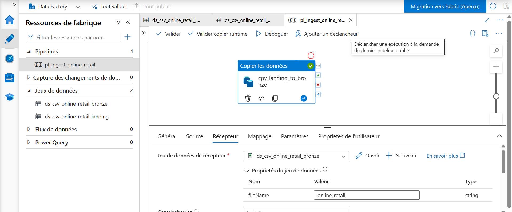
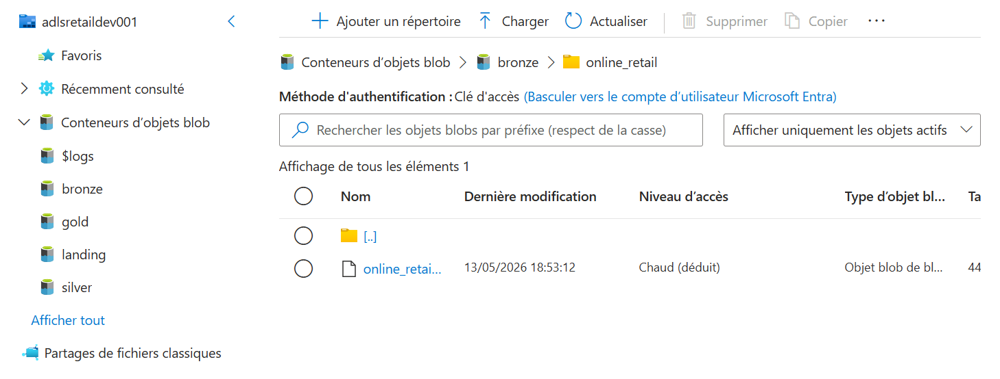

# 🚀 End-to-End Azure Data Pipeline (E-commerce Analytics)

## 📌 Overview
This project demonstrates the design and implementation of a complete data pipeline on Azure.

The goal is to ingest, transform, and analyze e-commerce sales data to generate business insights.

---

## 🎯 Business Use Case
A company wants to:
- Track sales performance
- Identify top-selling products
- Analyze revenue trends

---

## 🏗️ Architecture
Source (Kaggle Dataset)
↓
Landing Zone (Raw Upload)
↓
Azure Data Factory (Ingestion Pipeline)
↓
Bronze Layer (Raw Data Storage)
↓
Azure Databricks (Data Cleaning & Transformation)
↓
Silver Layer (Cleaned & Enriched Data)
↓
[Next: Gold Layer - Analytics]

---

## ⚙️ Technologies Used

- Azure Data Factory  
- Azure Data Lake Storage  
- Azure Databricks  
- SQL / PySpark  

---

## 📁 Repository Structure
```
project/
│
├── data/
│ ├── bronze/ # sample data (raw extracts)
│ ├── silver/ # cleaned data samples
│ └── gold/ # future analytics samples
│
├── notebooks/
├── architecture/
├── README.md
```

### ⚠️ Note:
The `data/` folder contains **sample extracts only** for demonstration purposes.  
Actual data is stored and processed in **Azure Data Lake (Bronze/Silver layers)**.
---


## 📂 Data Architecture

### 🟣 Landing Layer
- Raw data uploaded manually  
- Source: Kaggle (Online Retail Dataset)

### 🟤 Bronze Layer
- Data ingested using Data Factory  
- Stored without transformation 

### ⚪ Silver Layer
- Data cleaned and transformed using Databricks  
- Missing values handled  
- Data types corrected  
- New features created:
  - `line_total` (revenue per line)
  - `is_return` (returns indicator)
  - `year`, `month` (time analysis)

---

## 🔄 Pipeline Workflow

### 1. Data Ingestion
- Dataset uploaded to **Landing zone**
- Azure Data Factory pipeline copies data to **Bronze layer**

### 2. Data Transformation (Databricks)
- Data cleaning (null handling, type casting)
- Feature engineering (revenue, returns, time features)
- Output written to **Silver layer in Parquet format**

---

## 📊 Pipeline Visualization

### Azure Data Factory Pipeline


### Bronze Layer Output


### 📸 Silver Layer Output


---

## 🧠 What I Learned

- Designing data lake architecture (Landing → Bronze)
- Building ingestion pipelines with Azure Data Factory
- Performing data cleaning and transformation with PySpark
- Creating business-ready features for analytics
- Writing optimized data formats (Parquet)

---

## 📈 Next Steps

- Build Gold layer (KPIs & aggregations)
- Implement RFM analysis (customer segmentation)
- Create dashboards (Power BI / SQL)

---

## 👨‍💻 Author

Aboudoul Karim
Azure Data Engineer  
