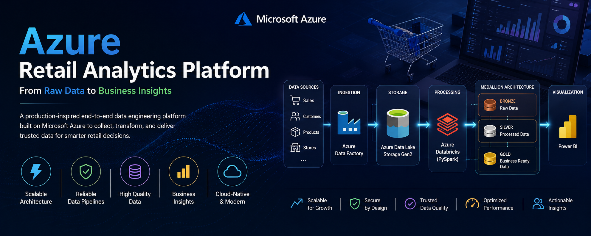
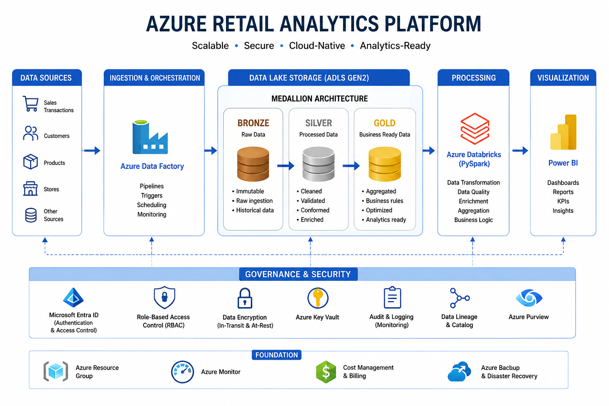

  

<h1 align="center">🚀 Azure Retail Analytics Platform</h1>

Designing a scalable cloud-native analytics platform with Microsoft Azure

A production-inspired end-to-end Data Engineering case study demonstrating how modern cloud architectures transform raw transactional data into trusted business insights.

<a href="#-solution-architecture">Architecture</a> • <a href="#-pipeline-overview">Pipeline</a> • <a href="#-dashboard-preview">Dashboard</a> • <a href="#-technical-case-study">Case Study</a>

---

# 📖 Executive Summary

Modern organizations generate massive amounts of operational data every day. Without a well-designed data platform, transforming this information into reliable business insights becomes increasingly difficult.

This project presents the design and implementation of a production-inspired Azure Data Engineering platform for a retail analytics scenario. The solution demonstrates how modern cloud services can be combined to build scalable ETL pipelines, improve data quality, and deliver business-ready datasets for analytics.

The platform follows the **Medallion Architecture (Bronze → Silver → Gold)**, leveraging **Azure Data Factory**, **Azure Data Lake Storage Gen2**, **Azure Databricks (PySpark)**, and **Power BI** to create a complete end-to-end analytics solution.

Beyond the implementation itself, this repository documents the engineering decisions, architectural rationale, and production considerations behind the solution, making it a complete technical case study.

---

# 📊 Project at a Glance

| Category          | Details                      |
| ----------------- | ---------------------------- |
| Industry          | Retail & E-commerce          |
| Scenario          | Sales Analytics Platform     |
| Architecture      | Medallion Architecture       |
| Cloud Platform    | Microsoft Azure              |
| Storage           | Azure Data Lake Storage Gen2 |
| Processing        | Azure Databricks (PySpark)   |
| Orchestration     | Azure Data Factory           |
| Visualization     | Power BI                     |
| Storage Format    | Parquet                      |
| Engineering Focus | Cloud Data Engineering       |

---

# ⭐ Key Highlights

* End-to-End Azure Data Engineering Platform
* Medallion Architecture (Bronze → Silver → Gold)
* Automated data ingestion with Azure Data Factory
* Distributed processing using Azure Databricks & PySpark
* Business-ready Gold analytical layer
* Interactive Power BI dashboard
* Production-inspired cloud architecture
* Complete technical case study

---

# 🏗️ Solution Architecture

> **📌 Replace the image below with your architecture diagram.**

The solution separates data ingestion, storage, processing, and analytics into independent layers, following the Medallion Architecture to ensure scalability, maintainability, and data quality throughout the data lifecycle.

---
